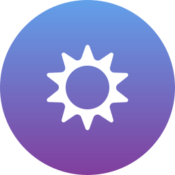

# Nickvision.Aura

 **A cross-platform base for Nickvision applications**

 Aura provides the following functionality across platforms (Linux and Windows):
 1. Stores application information: name, version, changelog etc
 2. Allows to load and save configuration files in JSON format
 3. Resolve system dependencies and common paths
 4. Localization infrastructure powered by gettext
 5. Can start an IPC server using named pipe. In this case, an application becomes single-instance. New instances will send command-line arguments to existing one and quit.
 6. Access system's network status and listen for changes
 7. Store credentials in a secure fashion
